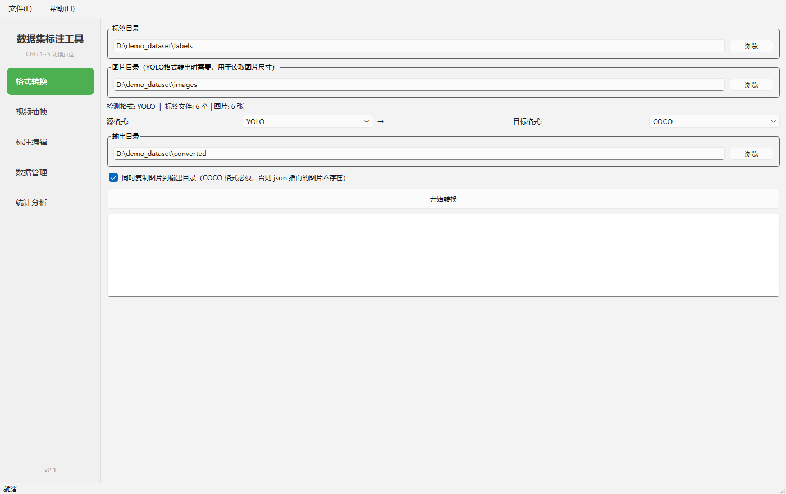
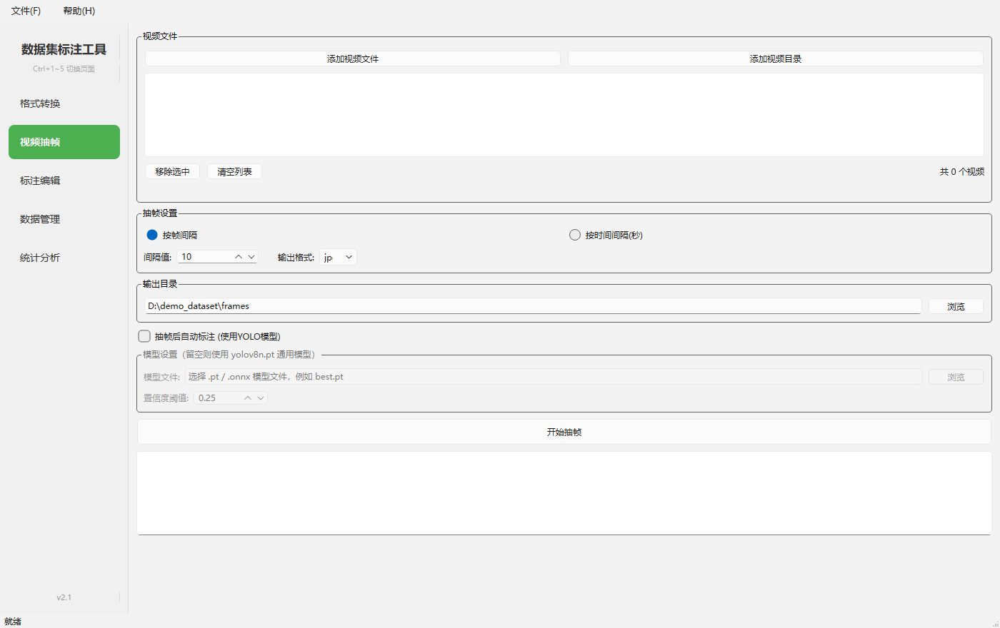
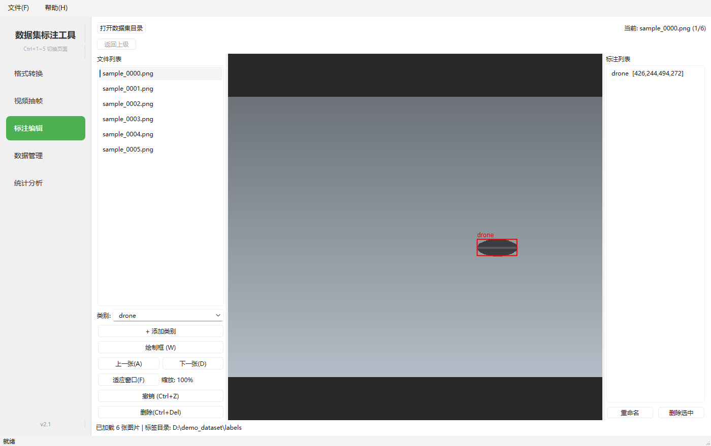
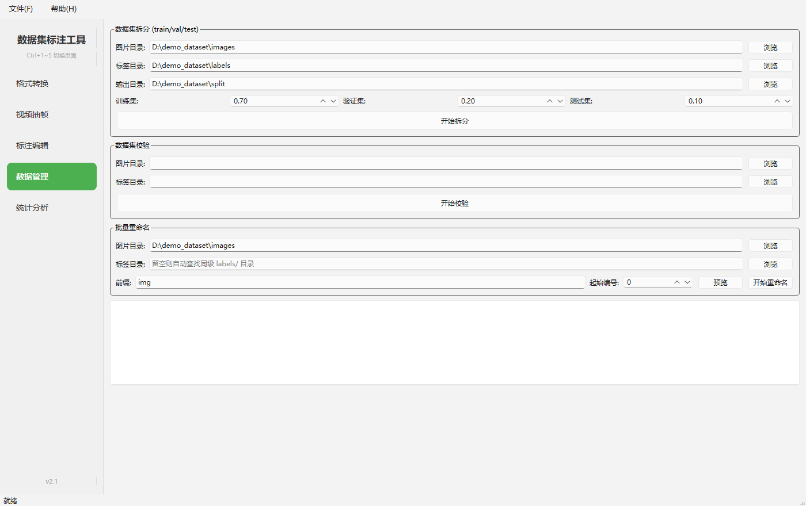
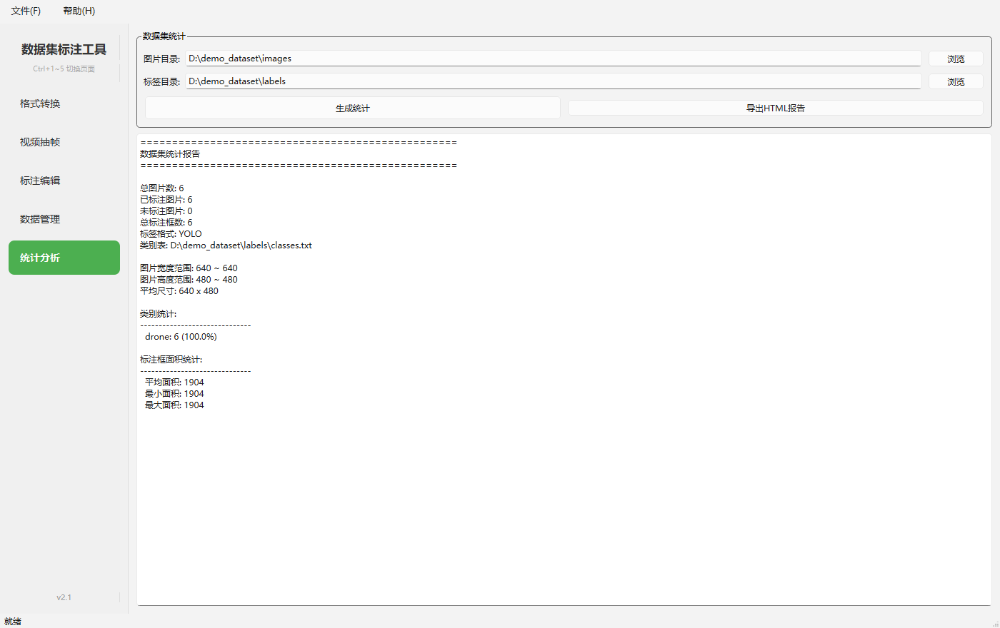

# 数据集标注工具

一站式**数据集标注 / 管理**桌面工具：格式互转、视频抽帧、AI 预标注、类 LabelImg 标注编辑、数据集拆分与校验、统计分析，全部集成在一个界面里。

基于 **Python + PyQt6 + OpenCV + Ultralytics(YOLO)**，可打包成免安装的便携版（绿色软件，拷走即用）。



## 功能特性

### 格式转换
- YOLO txt / COCO JSON / Pascal VOC XML **三种格式互转**
- 自动检测源格式并显示标签数量
- 可选**同时复制图片到输出目录**（转 COCO 时必需，否则 json 指向的图片不存在）
- 转换前会列出并清理上次残留的产物，目录中的其它文件一律保留
- 安全阀：输出目录与源目录相同或互相包含时**拒绝执行**

### 视频抽帧
- 支持 mp4 / avi / mov / mkv / flv / wmv / webm
- 按**帧间隔**或**时间间隔**抽帧，输出 jpg / png
- 可勾选「抽帧后自动标注」，并**自由指定 YOLO 模型路径**（.pt / .onnx），可设置信度阈值
- 模型路径、阈值、勾选状态会被记住；模型文件不存在时明确提示而不是静默失败



### 标注编辑（类 LabelImg）
- 左侧文件列表 + 中间画布 + 右侧标签列表
- 绘制 / 选择（Ctrl 多选）/ 移动 / 删除矩形框
- **滚轮缩放 1×–8×（以光标为中心）**，**右键拖拽平移**，`F` 适应窗口
- **Ctrl+Z 撤销**：新增 / 删除 / 移动框、修改类别、删除整张图片
- 删除的图片移入 `_deleted/` 暂存目录而非永久删除，可撤销恢复
- 标注框自动限制在图片范围内，不会产生越界坐标
- 新增类别会**立即写回 `classes.txt`**，避免类别 id 错位
- 自动识别 `labels/` 分离存储、图片与标签混放（labelImg 风格）两种目录结构



### 自动标注
- 基于 Ultralytics YOLO 推理（支持 YOLOv8 / YOLO11 等）
- 支持任意本地 `.pt` / `.onnx` 权重
- 批量推理，可设置置信度阈值，日志打印模型类别便于核对

### 数据集管理
- train / val / test 按比例自动拆分（重复运行会先清理上次产物，不会累积）
- 批量重命名：**支持预览**，执行前做冲突预检，采用两阶段改名避免中途失败损坏数据集
- 数据集校验：缺失标签、空标签、框越界、无效框、未知类别、孤立标签



### 统计分析
- 支持 **YOLO / VOC / COCO** 三种标签格式
- 总图片数 / 已标注 / 未标注 / 总框数、各类别实例数与占比
- 图片尺寸范围、标注框面积统计
- 导出 HTML 报告



## 快捷键

| 快捷键 | 功能 |
|---|---|
| `Ctrl+1` ~ `Ctrl+5` | 切换五个功能页面 |
| `W` | 切换绘制框模式 |
| `A` / `D` | 上一张 / 下一张 |
| `Delete` / `Backspace` | 删除选中的标注框 |
| `Ctrl+Z` | 撤销 |
| `Ctrl+Del` | 删除当前图片（可撤销） |
| `F` | 图片适应窗口 |
| 滚轮 / 右键拖拽 | 缩放 / 平移图片 |

## 环境要求

- Windows 10 / 11
- Python 3.10+
- 依赖见 `requirements.txt`

```bash
pip install -r requirements.txt
```

> 想用 GPU 推理就装 CUDA 版 torch；纯 CPU 用官方 CPU 版 torch 即可（本项目实测 CPU 推理约 74 ms/张，YOLOv8n @640，够用）。

## 运行

```bash
python main.py
```

无界面自检（验证所有页面能否正常构建，便于排查打包问题）：

```bash
python main.py --selftest      # 退出码 0 表示正常，结果写入 %TEMP%\dataset_tool_selftest.txt
```

## 打包成便携版（免安装）

```bat
build_portable.bat
```

脚本会依次完成：PyInstaller 构建 → 部署到程序目录 → 刷新桌面/开始菜单快捷方式 → 运行自检。

- 输出目录用环境变量 `APP_DIR` 覆盖，默认 `%USERPROFILE%\Desktop\数据集标注工具`
- 解释器用环境变量 `PY` 覆盖，默认自动查找
- 打包结果为一个文件夹（`数据集标注工具.exe` + `_internal\`），**拷到别的机器直接双击运行**，卸载 = 删除该文件夹

### 打包踩坑记录

`cv2` 的 `cv2.pyd` 运行时只加载与自身版本号匹配的 `opencv_videoio_ffmpeg<ver>_64.dll`。若 `site-packages\cv2` 下残留了其它版本的同名库并被一起打包，OpenCV 的 FFmpeg 后端会加载失败，表现为**视频抽帧报 `Cannot open video`**。`数据集标注工具.spec` 已按 `cv2.__version__` 精确挑选并剔除不匹配版本，避免该问题。

## 项目结构

```
├── main.py                    # 入口（含 --selftest 自检）
├── requirements.txt
├── build_portable.bat         # 一键构建便携版
├── 数据集标注工具.spec         # PyInstaller 打包配置
├── docs/                      # 截图与截图生成脚本
├── ui/
│   ├── main_window.py         # 主窗口（侧边栏 + 页面栈 + 窗口状态记忆）
│   ├── page_convert.py        # 格式转换
│   ├── page_extract.py        # 视频抽帧 + AI 预标注
│   ├── page_annotate.py       # 标注编辑（撤销栈 / 缩放平移）
│   ├── page_manage.py         # 数据集拆分 / 校验 / 重命名
│   ├── page_stats.py          # 统计分析
│   └── widgets/
│       ├── image_viewer.py    # 画布（绘制/移动/缩放/平移/夹取）
│       ├── label_list.py      # 标签列表
│       └── progress_dialog.py
├── core/
│   ├── converter.py           # 格式转换引擎
│   ├── extractor.py           # 视频抽帧
│   ├── annotator.py           # YOLO 推理
│   ├── dataset_manager.py     # 拆分 / 重命名
│   └── validator.py           # 标签校验
└── utils/
    ├── formats/               # yolo / coco / voc 读写
    ├── file_utils.py          # 路径与目录工具
    └── image_utils.py
```

## 技术栈

| 组件 | 选型 |
|---|---|
| GUI | PyQt6 |
| 视频/图像 | OpenCV |
| 模型推理 | Ultralytics (YOLO) |
| 图像处理 | Pillow / NumPy |
| 打包 | PyInstaller |

## 许可证

本项目依赖 **PyQt6**，而 PyQt6 采用 **GPLv3 / 商业双许可**。因此本项目整体以 **GPL-3.0** 发布（详见 `LICENSE`）。

> 如果你希望以 MIT 等宽松许可证发布，需要把 PyQt6 换成 **PySide6**（Qt 官方绑定，LGPL，API 基本一致）。

## 说明

- 本项目为个人自用工具，欢迎提 Issue 交流。
- 截图中的数据集为脚本生成的合成数据（`docs/make_screenshots.py`），不含任何真实数据。
